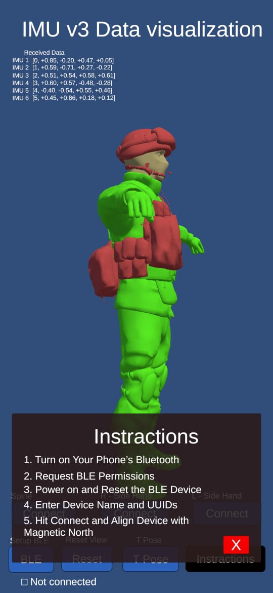

# IMU Data Visualization App

This project is an **IMU data visualization app** developed using **Unity** and the **Android BLE plugin**. It visualizes real-time motion data from **six BNO055 IMU sensors** on a 3D character model, enabling accurate representation of human movement.

## 📱 Features

- Visualizes IMU data (roll, pitch, yaw) on a 3D avatar.
- Supports real-time orientation from **6 BNO055 sensors**:
  - Spine
  - Right Hand
  - Left Hand
  - Chest
  - Shoulder
  - Head
- Built-in BLE (Bluetooth Low Energy) connectivity.
- Interactive UI with:
  - Connect buttons for each IMU module.
  - T-Pose calibration.
  - Reset and BLE setup controls.
  - Instruction panel for users.
- Developed using **Unity 3D** with **Android BLE plugin**.

## 🖼️ Screenshots

| Default View | Side View | T-Pose |
|--------------|-----------|--------|
|  |  |  |

(Replace the image links with correct relative paths like `assets/yourimage.jpg` in your repo.)

## 📦 Requirements

- Android device with BLE support
- Unity (tested with version 2021 or later)
- BNO055 IMU sensors (x6)
- Android BLE plugin for Unity (installed via Unity Package Manager)

## 🚀 Getting Started

1. Clone this repo.
2. Open in Unity.
3. Connect the IMUs to your BLE-compatible device.
4. Click **BLE Setup** → **Connect** → Calibrate with **T Pose**.
5. Observe the real-time avatar updates based on sensor orientation.

## 🧭 Instructions

1. Turn on your phone’s Bluetooth.
2. Request BLE permissions.
3. Power on and reset the BLE device.
4. Enter device name and UUIDs.
5. Hit **Connect** and align device with magnetic North.

## 📧 Contact

For more information, feel free to contact:  
📩 **sct19047@std.uwu.ac.lk**

---

### ⚠️ Disclaimer

This app is a research/development prototype and may require calibration and alignment tuning based on your hardware and BLE modules.

---
